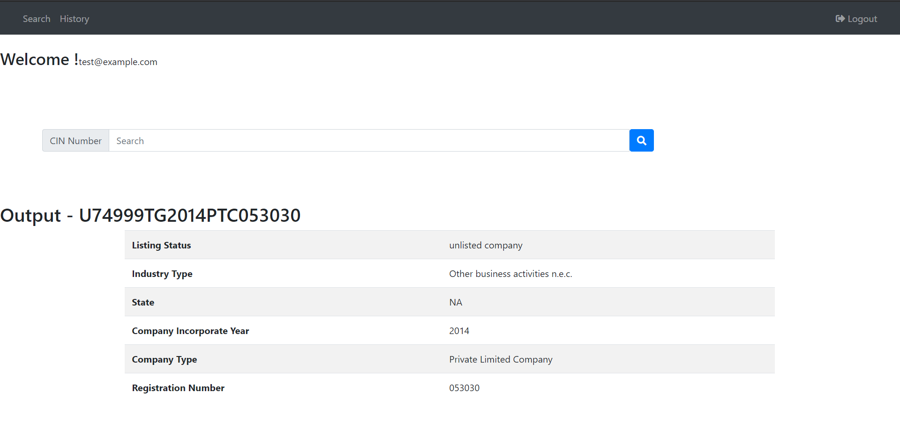

# README

This README would normally document whatever steps are necessary to get the
application up and running.

Things you may want to cover:

* Ruby version
    - 2.5.8
* Rails version
    - 6 
* Mysql version
    - sql server 5.7.30
    - workbench 8.0
* System dependencies
    - Any of the latest system having min 2GB RAM and 30GB ROM 

* Configuration of application in the local environment
    - Step 1) Clone the repo to your local machine
    - Step 2) Set the username and password in database.yml file of your local mysql connection
    - Step 3) Goto cin_details directory in your console
    - Step 4) Run the application with following commands in sequence 
        - bundle install
        - rake db:create
        - rake db:migrate
        - rake db:seed
        - run the application and goto root page or /search from url 

* Tesing Application
    - Step 1) 
        - Either login with the user id: test@example.com password: testing
        - Or Create a new user on the login page after going to the root path
    - Step 2)
        - Enter Any search String(CIN number) as following example which will display the result of scraped cin number
            - U74999TS2014PTC053030
    - Step 3)
        - click on history in nav bar to check the search history for the current logged in user

Home Page looks as follows

    
